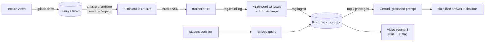

# Educational Platform — RAG tutor over recorded lectures

A student asks a question in Arabic. The tutor answers **only** from the
lecture transcript — simplifying the doctor's own explanation and reusing the
doctor's own examples and mnemonics — and points at the exact stretch of the
recorded lecture the answer came from.

The video is always served whole. An answer just moves the playhead to the
start of the relevant chunk and drops a 🚩 flag where it ends. **Playback is
never stopped at the flag** — the student can keep watching straight past it.



## Layout

```
app/                    FastAPI service
  config.py             every tunable value, read once from .env
  db/
    __init__.py         pgvector-aware connection pool (what the app uses)
    _generated_models.py  reflected from the schema — DO NOT EDIT, `make db-gen`
    models.py           the hand-written half: re-exports, the vector helper
  api/                  HTTP layer only (auth, lectures, chat)
    deps.py             get_current_user, require_student/require_doctor, get_conn
  schemas/              pydantic request/response models
  services/
    supabase_client.py  the publishable client, and the secret-key admin one
    security.py         verifying Supabase and Nest access tokens (never minting)
    authz.py            who may read whose data (ownership, not just role)
    embeddings.py       Gemini embeddings (batching, quota throttling)
    query_cache.py      question embeddings cached in Postgres
    engagement.py       video_events -> watch time + coverage (pure, tested)
    report.py           a student's week: engagement + questions + narrative
    report_cache.py     stored narratives, keyed by the figures behind them
    exam_stats.py       post-exam aggregation for the instructor (no model)
    subscriptions.py    paid access: which teachers a student may watch
    report_store.py     reports a completion froze, kept as issued
    triggers.py         which completions earn a report, and the background job
    notifications.py    how a report reaches the student and their doctor
    retrieval.py        vector search + grouping hits into video segments
    prompts.py          system instruction + the model's reply contract
    llm.py              generation with retry and a fallback model
    tutor.py            the RAG orchestration
  static/               demo UI (chat + player with segment flag)
    login.html/.js/.css   the login screen
    auth.js               session storage + the authenticated API client
    report.html/.js/.css  the weekly report, printed to PDF by the browser

scripts/                operational CLIs
  enroll.py             courses, lecture assignment, enrolment (what a report counts)
  generate_weekly_reports.py  write everyone's narrative ahead of time (optional)
  remove_demo_data.py   take fabricated demo rows back out of a database

rag/                    offline pipelines, not imported by the API
  bunny.py              Bunny Stream: list/upload videos, resolve a readable URL (CLI)
  audio.py              streams a source into 5-min wav chunks, one at a time
  transcribe.py         the pipeline: upload -> encode -> audio -> transcript (CLI)
  transcribe_cohere.py  Arabic ASR over the chunks (local Cohere model)
  transcribe_whisper.py superseded; kept for reference (writes permanent audio)
  chunking.py           transcript -> timestamped chunks (pure, tested)
  ingest.py             chunk -> embed -> store  (CLI)
  eval_retrieval.py     retrieval / answer smoke test (CLI)

db/                     FROZEN. schema.sql and migrations/001-014 are history
                        now, kept for the reasoning written into them. Nothing
                        applies them. See db/README.md.
scripts/gen_models.py   reflects a database into _generated_models.py
data/                   videos, audio chunks, transcripts
tests/                  pure-logic tests: chunking, segments, engagement
```

`app/` and `rag/` share `app.config` and `app.services`, so the ingest
pipeline and the live API can never disagree about the embedding model, its
dimension, or the chunking parameters.

## Schema

**The schema is not in this repository.** It lives in
[educational-platform-db](https://github.com/tokaM107/educational-platform-db),
because the Supabase project behind it is shared with the NestJS API and a
schema owned by one of its two consumers is a schema that drifts. Who owns
which table, and how to change one without breaking the other service, is in
that repository's `SCHEMA.md`.

`db/schema.sql` and `db/migrations/*.sql` here are frozen. They record how the
database got to where it is and are worth reading for that; they are not
applied to anything.

`app/db/_generated_models.py` is a drift canary. It is SQLAlchemy models
reflected from the database by `scripts/gen_models.py`, and **nothing imports
it at runtime** — the API and the ingest pipeline talk to Postgres through the
psycopg pool and hand-written SQL, as they always have. Its only job is to
change when the schema changes:

```bash
make db-gen        # regenerate
make db-gen-check  # regenerate and fail if it differs from what is committed
```

CI runs `db-gen-check` against a database built from the migrations. A red
build means the schema moved and this file did not, or somebody edited it by
hand. Either way the fix is `make db-gen` and commit.

Hand-written additions go in `app/db/models.py`, never in the generated file.
API request and response shapes stay in `app/schemas/` and are not derived from
either — a column can change without the HTTP contract following it around.

## Setup

```bash
python -m venv .venv && source .venv/bin/activate
pip install -r requirements.txt

docker compose up -d                       # Postgres 16 + pgvector

# The schema is not in this repository any more. Build the database from the
# migrations, which live in educational-platform-db, checked out alongside:
cd ../educational-platform-db && supabase db reset
```

The local compose image is `pgvector/pgvector:pg16`; Supabase runs Postgres 17,
and CI builds against `pg17` to match it. Changing the tag in
`docker-compose.yml` will not work against an existing volume — Postgres
refuses to start on a data directory from another major version. Recreate it
deliberately (`docker compose down -v`) or leave it; nothing in this project
depends on the difference today.

**A fresh database locks every video.** Watching needs a subscription to the
lecture's teacher, so existing students need one granting before they can play
anything:

```bash
python -m scripts.enroll subscribe --student-id 2 --doctor-id 1
```

`.env` also takes `REPORT_TIMEZONE` (default `Africa/Cairo`). A week is seven
*local* days: in UTC, a 23:00 session lands on the next day, moving study onto
the wrong day of the report and, at the week's edges, out of it entirely.

Before a report can be built, two things have to be true, and both are real
administrative data rather than anything invented: the lectures have to belong to
a course, and the student has to be enrolled on it. That is what the report counts
"3 of 5 lectures" against.

```bash
python -m scripts.enroll list                    # what exists, and what is missing
python -m scripts.enroll course --title "Anatomy 1" --doctor-id 1
python -m scripts.enroll assign --course-id 1 --lectures 1,2,3
python -m scripts.enroll add --student-id 2 --course-id 1
python -m scripts.enroll rename --user-id 1 --name "..."   # fix placeholder names
```

`enroll list` is the one to run first: it prints every user, course and lecture,
and tells you which lectures are in no course and which have no transcript, both
of which leave holes in a report.

**There is no seed script, and no fabricated study.** Every figure in a report
comes from `video_events` the player recorded while a student was actually in
front of a lecture, and from questions they actually answered. A student who has
not watched anything gets a report that says exactly that, which is the truth and
more useful than an invented week.

## Ingest a lecture

Videos live in a **Bunny Stream** library, not on disk. The pipeline uploads a
lecture once, remembers its Bunny id, and from then on reads the audio straight
off the CDN — so re-transcribing needs nothing local, and neither does
transcribing a lecture somebody else uploaded.

```bash
# 1. upload to Bunny (once) and transcribe
python -m rag.transcribe --lecture-id 1 --video sample1.mp4

# already on Bunny? give the id and nothing is uploaded
python -m rag.transcribe --lecture-id 1 --bunny-video-id <guid>

# stop after cutting the chunks, without loading the ASR model
python -m rag.transcribe --lecture-id 1 --video sample1.mp4 --audio-only

# what is in the library, and is it encoded yet?
python -m rag.bunny list
python -m rag.bunny list --unfinished
python -m rag.bunny show <guid>

# 2. transcript -> chunks -> embeddings -> Postgres
python -m rag.ingest --lecture-id 1 \
    --title "Skeletal System" \
    --transcript data/transcripts/lecture_1.txt \
    --video sample1.mp4

python -m rag.ingest --dry-run     # chunking only: no API calls, no writes
```

`.env` needs three values from the Stream library's API tab:

```env
BUNNY_STREAM_LIBRARY_ID=...
BUNNY_STREAM_API_KEY=...        # write access to every video — server only
BUNNY_STREAM_CDN_HOSTNAME=vz-xxxx.b-cdn.net
```

**Enable MP4 Fallback in the library's encoding tab before uploading anything.**
Only videos uploaded after it is on get MP4 renditions; without one the pipeline
falls back to reading the HLS playlist, which works but is slower.

**Nothing is stored.** The video is never downloaded: ffmpeg is given the Bunny
URL and writes raw PCM to a pipe, which this end cuts into five-minute wavs one
at a time. Each chunk is transcribed and deleted before the next is written, so
peak temporary disk is **one chunk — about 9.6 MB** regardless of lecture
length, and it all lives in a `tempfile.TemporaryDirectory` that goes away on
success, failure or cancellation alike. Measured on the 74-minute sample: 9.2 MB
peak, against 274 MB left behind by the previous version.

The pipe is also what paces it. While the ASR is busy nobody is reading, the
buffer fills and ffmpeg blocks — so it cannot run ahead and pile up chunks.

It asks for the *smallest* rendition on purpose — every rendition carries the
same soundtrack, so fetching 240p instead of 1080p is the same audio for a
fraction of the bytes.
Anything that needs the picture rather than the sound asks for it explicitly:
`bunny.rendition_url(video, prefer="highest")`, or a specific height, which
resolves down to what the source actually has since Bunny does not upscale.

`bunny.iter_videos()` pages through the whole library for batch work, and
`bunny.is_finished(video)` is the guard to run before anything expensive — a
video still transcoding has no renditions, and skipping the check turns "not
ready yet" into a 404 from ffmpeg.

Re-running replaces that lecture's chunks instead of duplicating them.
`lectures.bunny_video_id` holds the Bunny GUID; `lectures.video_url` still names
the local file a lecture was ingested from, and lectures move to Bunny one at a
time rather than all at once. The authenticated `/api/lectures/{id}/video`
endpoint prefers `bunny_video_id`, verifies that Bunny finished encoding, then
redirects the browser to the highest available MP4 rendition (or the HLS
playlist when MP4 fallback is unavailable). Lectures without a Bunny GUID keep
using the local `data/videos` fallback.

## Run

```bash
ENABLE_DEMO_UI=true uvicorn app.main:app --reload
```

The demo UI is disabled by default. Set `ENABLE_DEMO_UI=true` only for local
development. Without it, `/` and `/static` are not registered; the API,
`/docs`, and `/health` remain available.

The isolated LLM-assisted essay grading evaluation prototype has its own opt-in
flag and is documented in [docs/ESSAY_GRADING_MVP.md](docs/ESSAY_GRADING_MVP.md).
Its proposed production database audit model is documented separately in
[docs/ESSAY_GRADING_STORAGE_DESIGN.md](docs/ESSAY_GRADING_STORAGE_DESIGN.md).

```text
http://localhost:8000/       demo UI (only when explicitly enabled)
http://localhost:8000/docs   OpenAPI
```

To run the API without the demo UI:

```bash
uvicorn app.main:app --reload
```

Endpoints below require `Authorization: Bearer <supabase access token>` unless
their description says public. `/health` is also public.

| Endpoint | Purpose |
| --- | --- |
| `POST /api/auth/login` | email + password → Supabase session (public) |
| `POST /api/auth/refresh` | refresh token → a new access token |
| `POST /api/auth/logout` | revoke the session server-side |
| `POST /api/auth/password/forgot` | email a six-digit recovery code (public) |
| `POST /api/auth/password/reset` | check the code, set a new password (public) |
| `GET /api/auth/me` | the application user behind the token |
| `POST /api/search` | public, unlimited catalog-only AI search |
| `GET /api/search/cases` | public search-assistant sample prompts |
| `POST /api/chat` | question → grounded answer + video segments + citations |
| `POST /api/chat/sessions` | create a thread from `lecture_id`; student identity comes from authentication |
| `GET /api/chat/sessions` | paginate the caller's threads, optionally by lecture |
| `GET /api/chat/sessions/{session_id}/messages` | paginate the caller's stored messages in stable order |
| `POST /api/chat/sessions/{session_id}/messages` | idempotently generate and persist a contextualized grounded turn |
| `GET /api/lectures` | lectures with chunk count and duration |
| `GET /api/lectures/{id}/video` | the whole video, with byte-range support so seeking works |
| `POST /api/events` | record one video event (insert only, deliberately trivial) |
| `GET /api/events/analytics` | watch time / time away / session length for a session |
| `GET /api/reports/weekly` | a student's week on a course, with a generated narrative |
| `GET /api/reports/subjects` | student/course pairs **the caller** may open a report for |
| `GET /api/reports/{id}` | a report a completion produced, as it was issued |
| `GET /api/exams` | the caller's own lectures that have questions (doctors) |
| `GET /api/exams/{lecture_id}` | post-exam statistics for one lecture (its doctor only) |
| `POST /api/grading-demo/grade` | opt-in two-stage essay evaluation prototype (any authenticated user) |
| `POST /api/subscriptions` | subscribe the authenticated student to a teacher |
| `GET /api/subscriptions/access` | may the caller watch this lecture? |
| `GET /api/notifications` | the caller's inbox, with the unread count |
| `POST /api/notifications/{id}/read` | mark one read |

```bash
TOKEN=$(curl -s localhost:8000/api/auth/login -H 'Content-Type: application/json' \
  -d '{"email":"you@example.com","password":"…"}' | python -c 'import json,sys;print(json.load(sys.stdin)["access_token"])')

curl -s localhost:8000/api/chat \
  -H 'Content-Type: application/json' -H "Authorization: Bearer $TOKEN" \
  -d '{"message":"عظمة القعبرة اسمها ايه بالانجليزي وليه؟","lecture_id":1}'
```

```jsonc
{
  "answer": "عظمة الكعبرة اسمها بالإنجليزي الراديوس (Radius) [2]. …",
  "grounded": true,
  "segments": [
    { "start_ts": 1158, "end_ts": 1247,          // player seeks here, flag there
      "start_label": "00:19:18", "end_label": "00:20:47",
      "video_url": "/api/lectures/1/video" }
  ],
  "citations": [ { "index": 1, "start_ts": 1122, "text": "…", "distance": 0.2583 } ]
}
```

## How the pieces work

**Chunking** (`rag/chunking.py`) — a sliding 120-word window with 25 words of
overlap, taken inside each 5-minute ASR block. The ASR barely punctuates (one
block has 13 sentence marks across 747 words), so sentence splitting is not an
option; a whole block is too coarse to retrieve. At this lecturer's pace
~120 words ≈ 50 seconds of video, which is a useful jump target. Windows never
cross a block header, so timestamps stay honest — they are interpolated inside
the block's own time range.

**Embeddings are computed once, never per request.** The transcript is
embedded by `rag/ingest.py` and lives in `transcript_chunks.embedding
vector(1536)`; the API only ever reads it. Two consequences worth knowing:

- Re-running ingest reuses the stored vector for every chunk whose text has
  not changed, so editing part of a transcript re-embeds only the affected
  chunks (a full re-run of this lecture: 126 embeddings and ~2 minutes the
  first time, 0 embeddings and 3 seconds after). `--reembed` forces the lot.
- The one thing that must be embedded at request time is the student's
  question — a vector search cannot compare text to vectors otherwise — so
  those are cached in `query_embeddings`, keyed by hash + model + dimension.
  A repeat question costs a 2 ms lookup instead of a ~400 ms API call and
  spends no quota.

`transcript_chunks.embedding` is indexed with **HNSW** (`vector_cosine_ops`,
matching the `<=>` operator used in the search). At 126 rows Postgres still
prefers a sequential scan because it is genuinely cheaper; the index takes
over as lectures are added. Existing databases: apply
`db/migrations/001_vector_index_and_query_cache.sql`.

**Retrieval** (`app/services/retrieval.py`) — cosine distance over
`transcript_chunks.embedding`, then neighbouring hits are merged into one
continuous segment so the student gets one "play from here" button per idea
rather than three that point at the same minute. Playback backs up
`SEGMENT_LEAD_IN` seconds so it starts on a sentence.

**Grounding** — three layers, because none is sufficient alone:

1. a coarse distance cut-off (`MAX_DISTANCE`) drops obviously unrelated chunks;
2. the model only ever sees transcript excerpts and is told to refuse anything
   outside them;
3. it must return `found` and `used_excerpts` as structured JSON, so an
   off-topic question ends as an honest refusal with no video segment, and the
   segments point only at the excerpts the answer was actually built from.

Layer 3 matters: measured on this lecture, on-topic hits sit at 0.25–0.31 and
an off-topic question ("what raises stroke risk?") still lands at 0.39, so
distance alone cannot separate them.

**Engagement tracking** (`app/static/app.js` → `video_events` →
`app/services/engagement.py`) — the player records `play` / `pause` / `seek` /
`complete`, plus a `heartbeat` every 30 seconds *while the video is actually
running*, plus `tab_hidden` / `tab_visible`. The heartbeat is what separates
"watched for half an hour" from "pressed play and left the room"; without it a
play/pause pair says nothing about the time in between.

Watch time is then **reconstructed**, never subtracted. `last video_ts - first
video_ts` is the tempting answer and it is wrong: a jump from 00:01:40 to
00:08:20 adds six minutes of video position and zero seconds of watching, and
rewatching a stretch adds nothing at all. So `engagement.replay()` walks the
session in real time — `created_at` gives the elapsed seconds, the event types
say whether the video was running through them — and adds up the playback
intervals. A gap larger than three heartbeats is capped, because it means
events went missing (sleeping laptop, dropped network) rather than that
somebody watched in silence.

Four numbers, deliberately never merged:

| | |
| --- | --- |
| `watch_time_seconds` | the video was playing |
| `session_duration_seconds` | first event to last, pauses and absences included |
| `time_away_seconds` | the lecture page was hidden |
| `lecture_duration` | the lecture's own length |

A 180-minute session on a 75-minute lecture with 68 minutes watched and 42
minutes away is all four at once.

What `tab_hidden` means is exactly "this page stopped being visible". A
switched tab, a locked screen and a minimised window are the same event, and
nothing here identifies what the student looked at instead — so it is reported
as time away from the lecture, not as distraction.

`video_events` is indexed on `(student_id, lecture_id, session_id, created_at)`,
which is the analytics query's exact shape: one ordered range scan instead of a
filter-and-sort. As with the HNSW index, a table this small still gets a
sequential scan until it grows.

**The weekly report** (`app/services/report.py`, `/static/report.html`) — one
student, one course, seven days, assembled from rows that already exist. Open
it from the 📄 button in the player, or at `/static/report.html` — it reports on
whoever is logged in. A doctor can add `?student_id=<id>`, and the server checks
they teach that student before answering.

The page reads as prose with the figures set into it, not as a grid of numbers:
"شفت 45% من مادة الأسبوع" says something a tile reading `45.1` does not. The
week is drawn as a row of bars, coverage as a ring, and where the time went as
one stacked bar — each replacing several numbers nobody would have compared by
eye. Per-lecture numbers sit behind a "التفاصيل" toggle, and are opened
automatically for printing.

The measurements come from replaying the week's events per lecture; the only
generated part is the closing narrative, and it is generated **from the
measured numbers**, not from the raw events. Three of them are worth knowing:

- **coverage** — how much of a lecture was seen at least once, rewatching
  counted once. This is the number that catches a lecture "completed" by
  skipping through it: the seeded demo has one at 100% finished and 28%
  covered.
- **parts never watched / parts replayed** — the holes and the overlaps in the
  coverage, reported as timestamps. A rewound stretch is the strongest signal
  in the whole table: it is the student telling you which explanation did not
  land the first time.
- **time away** — carried through from `tab_hidden` with its meaning intact.
  The prompt forbids the model from reading it as distraction, the page says
  so under every occurrence, and the footnote says it again.

**Narratives are stored, not regenerated.** The numbers are recomputed on every
request because a replay costs milliseconds. The narrative costs a model call of
about half a minute, and `report_narratives` keeps it against a hash of the exact
figures it was written from (the same trick `query_embeddings` uses for
questions). So while the week is still running and the student keeps watching,
the fingerprint moves and the narrative is rewritten; once the week closes it
settles and the report becomes a fixed document. That last property is the point
— a report a student is meant to act on cannot give different advice on every
refresh. Measured here: 25 s to generate, **12 ms** to serve afterwards.

**Instructor post-exam view** (`app/services/exam_stats.py`,
`/static/exam.html`) — how the class did on one lecture's questions: average
score, per-question correct %, per-topic breakdown, score distribution, and the
roster. Every figure is a `GROUP BY` over `question_attempts` joined to
`questions`. **No model is involved**, so the page answers in ~20 ms and says the
same thing every time it is opened; prose commentary can be layered on later if
the numbers turn out not to speak for themselves.

Two definitions kept apart, because "score" is ambiguous:

| | |
| --- | --- |
| `score` | correct ÷ **every** question in the exam — unanswered counts as wrong, which is what a mark means |
| `accuracy` | correct ÷ what the student actually attempted — fair to a partial sitting, and the right lens on a *question* |

`correct_percent` counts a student right if any attempt was (matching the weekly
report), and `first_attempt_percent` keeps the stricter reading beside it — the
gap between the two is where a question needed a second think. Figures cover the
enrolled cohort; attempts from anyone else are excluded and counted in
`attempts_from_non_enrolled`, so one stray row cannot move an average.

**Distractor analysis.** `question_attempts.selected_option` records the choice
itself, so the view shows which wrong answer the class went for. That is the
difference between *"38% got it wrong"* — which might just be a hard question —
and *"50% of them chose A"*, which says one distractor is teaching something
false or the stem is ambiguous. A wrong option taken by a quarter of the answers
or more is called out; wrong answers spread evenly across the distractors are
not, because that is a hard question and nothing is broken. Options nobody picked
are still listed: a distractor no one touches means the question is really a
three-way choice.

Attempts recorded before that column existed carry no choice, so every
distribution reports the count it was built from and never passes off a partial
picture as a complete one.

**`/api/exams/*` hands out the answer key** — a distractor table is unreadable
without marking which option was right. It is an instructor endpoint and needs
authentication before launch; today nothing stops a student calling it.

## Authentication

Supabase Auth owns its credentials — password hashing, sign-in, token issuance
and expiry, refresh rotation, email verification and recovery. The main NestJS
application also issues user access tokens. FastAPI verifies both token types
but never mints either one and never sees a password.

What stays here is verification, identity mapping and authorization:

```
Supabase auth.users.id  (UUID, owns the password)
        |
        |  users.auth_user_id
        v
public.users.id         (INTEGER, what every domain table keys on)
        ^
        |  Nest access token sub
        |
Nest user identity      (positive integer, aud: user)
```

The integer id is unchanged and all eleven foreign keys still point at it. The
UUID identifies the login; the integer identifies the person the rest of the
schema knows about.

A request arrives with `Authorization: Bearer <token>`. `decode_access_token`
(`app/services/security.py`) selects one fixed verification contract from the
JWT algorithm:

- Supabase tokens must use `ES256` and continue through the project's cached
  JWKS verifier. Their UUID `sub` maps to `public.users.auth_user_id`.
- Nest tokens must use `HS256`, verify with `NEST_JWT_ACCESS_SECRET`, carry the
  `user` audience, and include `sub`, `exp`, `aud`, `role`, and `email`. Only a
  positive integer subject and the `student` or `doctor` role are accepted. The
  integer `sub` maps directly to `public.users.id`; `admin` audience tokens are
  rejected.

Missing, malformed, expired, wrongly signed, wrong-audience, or valid-but-
unlinked tokens all come back **401** with `WWW-Authenticate: Bearer`; details
of signature and claim failures are not exposed. A verified user who is not
allowed to perform an operation gets **403**.

**The effective application role is always read from the database.** Supabase's
`role` claim is a Postgres role and is ignored. A Nest token's signed role must
match the current `public.users.role`; a mismatch is rejected with 401 so a
token issued before a role change cannot keep stale privileges.

`NEST_JWT_ACCESS_SECRET` is required and must be the exact value of Nest's
`JWT_ACCESS_SECRET`, with at least 32 characters. Keep it server-only and never
log it. Because HS256 is symmetric, a compromise of FastAPI would give an
attacker enough key material to mint tokens that Nest trusts. Migrating the two
services to asymmetric signing, where FastAPI holds only a public verification
key, is the recommended long-term design.

**FastAPI owns the session.** The browser talks only to this API and never to
Supabase directly, so a session is created in one place and ended in one place.
The page keeps the tokens and `app/static/auth.js` attaches, refreshes and
discards them; every protected request in the UI goes through its `api()`
helper, so no page carries token logic of its own.

One exception, and it is deliberate: a `<video>` element fetches its own source
and cannot be given a header, so `/api/lectures/{id}/video` also accepts the
token as a query parameter. Same token, same verification — only the transport
differs, and only on that route.

### Password recovery

"نسيت كلمة المرور؟" on the login page runs a two-step flow, both steps public
because being unable to log in is the whole premise:

```
POST /api/auth/password/forgot   {email}                       -> code by email
POST /api/auth/password/reset    {email, code, new_password}   -> password set
```

Supabase generates the code, mails it, decides how long it lives and verifies
it. **Nothing here stores a code** — there is no reset-codes table and there
should not be one: a second store of a second secret is a second thing to leak.

**This needs one change in the Supabase dashboard.** Authentication → Emails →
*Reset Password* must render `{{ .Token }}`. Left on the default
`{{ .ConfirmationURL }}` it mails a link instead of a code, and the code box on
the login page has nothing to type into it.

Two things the flow is careful about. It answers identically whether or not the
address is registered, so it cannot be used to find out who has an account — on
a platform whose users are all students at one school, that is worth
protecting. And the new password is set through the admin API rather than
through the session the code produces, so the recovery session is never handed
back as a way in; every other session for that user is signed out at the same
time, since whoever forced the reset may be signed in as them right now.

### Rate limits

`app/services/rate_limit.py`, applied to sign-in and to both recovery steps.

It exists because of where the session is owned. Every login and every code
reaches Supabase *from this server*, so Supabase's per-IP limits see the entire
user base as one client — they cannot tell an attacker from everybody else, and
tripping them would lock out everybody at once. The only place callers are still
distinguishable is here.

The limiter is in-process, so the budget is per worker and a restart forgets it.
That is enough to slow password guessing and to stop the reset form being used
to send mail; it is not enough on its own at scale, where this belongs in Redis
or at the proxy.

LLM requests use a separate production limiter in
`app/services/llm_quota.py`. Every authenticated user shares one budget across
chat questions, contextual chat messages, smart search, generated report
narratives, and essay grading. The default is 10 request units per UTC day and
is configurable with `LLM_DAILY_QUERY_LIMIT`. Reservations are atomic rows in
`llm_daily_usage`, so multiple workers and restarts cannot multiply or erase the
budget. The response includes `X-RateLimit-Limit`, `X-RateLimit-Remaining`, and
`X-RateLimit-Reset`; an exhausted budget returns 429 with `Retry-After`.

Authorization lives in `app/services/authz.py`, because a role is rarely the
whole answer. Being a doctor is not permission to read every student on the
platform; teaching them is. `may_view_student` admits exactly two cases — it is
your own data, or you are the doctor teaching them.

## Paid access

A subscription is per **teacher** and unlocks everything they publish. It is
separate from enrolment because the two change independently: a subscription
lapses without un-enrolling anybody, and a student subscribed to a teacher may be
enrolled on none, one or several of that teacher's courses.

Enforced in two places — `GET /api/lectures/{id}/video` answers **402** without
one, and `scripts.enroll add` refuses to enrol a student on a course whose
teacher they do not pay for, so nobody is enrolled on something they cannot open.
`GET /api/subscriptions/access` lets the UI show a lock before the student
presses play.

```bash
python -m scripts.enroll subscribe   --student-id 2 --doctor-id 1
python -m scripts.enroll unsubscribe --student-id 2 --doctor-id 1
```

**This is a real boundary now.** The viewer is the authenticated user, read
from a verified Supabase token, so it can no longer be walked past by sending
somebody else's id. `ENFORCE_SUBSCRIPTIONS=false` turns it off in development;
authentication itself stays on either way.

Two things `subscriptions` deliberately does not record, both of which need a
column the day the product needs them: **when access ends** (no `expires_at`, so
a row means access until it is deleted) and **what was paid** (no amount or
processor reference — this records the entitlement a payment produced, not the
payment).

**Reports also fire on what a student does, not only on the calendar.** The
pipeline is the same one — Stage 1 replays `video_events` into figures, Stage 2
hands those figures to the model — and only the trigger differs:

| Trigger | Report | Scope |
| --- | --- | --- |
| a `complete` event that finishes the course's last lecture | `module` | the whole course, all time |
| an answer that finishes a lecture's last question | `exam` | the course, framed on that lecture |

Both run in FastAPI `BackgroundTasks`, so the student's request returns before
the model is called — measured: **8 ms** to record the event, the report lands
about half a minute later. Because they run after the response they cannot use
the request's pooled connection, so each opens its own, and every failure is
swallowed and logged: a report that did not get written must never look like a
lost quiz answer.

A completion report is **frozen** in `reports`. "You finished the module"
describes an instant; recomputed a fortnight later, after the student had gone
back and rewatched half of it, the same query would quietly rewrite history.
Uniqueness is enforced by an index, because `complete` fires again every time
somebody replays the last minute.

Both the student and the doctor who teaches the course get a row in
`notifications`, worded for who is reading — *«خلّصت المقرر — تقريرك جاهز»*
against *«أحمد خلّص «Anatomy 1»»*. The site polls the inbox from the 🔔 in the
player and opens the frozen report from there. Polling, not a socket: the
requirement is "tell them next time they are on the site", which a table with a
`read_at` column does exactly, with nothing to keep running and nothing lost if
the browser was closed while the report was being written.

**A weekly report is produced when someone asks for it.** Pressing 📄 in the player opens
the page, which draws the measured half immediately and writes the narrative if
there is not already one for those figures — roughly half a minute the first time,
milliseconds afterwards. No batch run is required for a report to exist.

`scripts/generate_weekly_reports.py` is an optional warm-up: run it after the week
closes and every student's narrative is already stored before anyone opens it. It
is safe to re-run — a narrative whose figures have not moved is left alone — and
exits non-zero if any student failed, so a cron wrapper can alert on it. Two tabs
opening the same uncached report will each ask the model once; the second write
simply replaces the first, so it costs a duplicate call rather than a wrong
answer.

If the model is unreachable the report still returns every number, and falls back
to the stored narrative for that week even if the figures have since moved,
saying so. `?narrative=false` skips the model entirely; `?refresh=true` rewrites.

**PDF** is the browser's own "Save as PDF" behind a `window.print()` button,
with a `@media print` stylesheet — no PDF library on the server, and no second
renderer that could drift out of step with the page.

**Degraded mode** — if Gemini is overloaded, generation retries, then falls
back to `CHAT_FALLBACK_MODEL`. If that fails too, the student still gets the
retrieved video segment with a notice instead of an error.

Conversational RAG budgets are configurable with `LLM_CONTEXT_WINDOW`,
`CHAT_MAX_INPUT_TOKENS`, `CHAT_MAX_OUTPUT_TOKENS`,
`CHAT_SAFETY_MARGIN_TOKENS`, `CHAT_REWRITE_HISTORY_TOKENS`,
`CHAT_ANSWER_HISTORY_TOKENS`, `CHAT_SUMMARY_TOKENS`,
`CHAT_MAX_STUDENT_MESSAGE_TOKENS`,
`CHAT_SUMMARY_UPDATE_THRESHOLD`, `CHAT_REWRITE_MAX_OUTPUT_TOKENS`,
`CHAT_SUMMARY_MAX_OUTPUT_TOKENS`, `CHAT_HISTORY_LOAD_LIMIT`,
`CHAT_RETRIEVAL_CANDIDATE_LIMIT`, `CHAT_LLM_TIMEOUT_SECONDS`,
`CHAT_PROMPT_RESIZE_MAX_ATTEMPTS`, `CHAT_TOKEN_COUNT_RETRY_ATTEMPTS`, and
`CHAT_TOKEN_COUNT_RETRY_DELAY_SECONDS`.
The defaults cap input at 12,000 tokens and output at 1,200 tokens while still
checking the configured model context window before every final generation.

`CHAT_TRANSCRIPT_TOKENS` was removed: transcript evidence no longer has a hidden
6,000-token ceiling. Ranked, relevant, lecture-scoped chunks use whatever remains
inside `min(CHAT_MAX_INPUT_TOKENS, LLM_CONTEXT_WINDOW - output - safety margin)`
after the required instructions, latest question, bounded memory and provider
formatting. Dynamic means "the safe remaining product capacity", not unlimited
context and not the entire transcript. Raising `CHAT_MAX_INPUT_TOKENS` can improve
evidence coverage, but also increases latency and input-token cost.

Chat budgeting never imports `google.genai.local_tokenizer`, Transformers, Gemma,
Torch or Torchvision. Individual messages and candidate chunks use a deliberately
conservative, dependency-free UTF-8 estimate for provisional selection, stored as
`estimate:utf8-bytes-div-2:v1:for:<model>`. That value is explicitly estimated and
never substitutes for final validation. Immediately before answer generation, the
complete assembled conversation is sent to Gemini's official `count_tokens` using
the configured `CHAT_MODEL`. If it is too large, a bounded resize loop removes the
old summary, oldest complete turns, continuity-only chunks, then the lowest-ranked
fresh evidence, rebuilding and recounting every time. If exact provider validation
cannot be completed after transient retries, generation fails closed with a
controlled 503; an unvalidated oversized prompt is never sent.

Provider usage is stored separately: rewrite usage on the user `chat_messages`
row, answer usage on the assistant row, and latest rolling-summary usage on
`chat_sessions`. `input_tokens`, `output_tokens`, and `total_tokens` come from
Gemini `usage_metadata` when available; provisional `token_count` retains its
estimator name. See [the Arabic monthly AI cost estimate](docs/AI_MONTHLY_COST_ESTIMATE_AR.md)
for editable small/medium/large scenarios and current pricing sources.

## Tests

```bash
pytest tests -q                    # pure logic + auth, no database or network
python -m rag.eval_retrieval       # retrieval against the real database
python -m rag.eval_retrieval --with-answer
```

`tests/test_auth.py` and `tests/test_security.py` cover authentication and
authorization without touching Supabase or Postgres. Nest JWTs are signed and
verified locally in the tests, Supabase's JWKS call is stubbed, and
`tests/fake_db.py` stands in for the connection so a test can assert on the
queries that were actually run — including whether the id came from the token
rather than the request body.

## Notes and limits

- Timestamps assume words are evenly spaced inside a 5-minute block, since the
  ASR gives no word-level timings; a segment can start a few seconds off. Emit
  word-level timings from the ASR step to make seeking frame-accurate.
- The Gemini free tier counts every embedded text (not every HTTP call) toward
  100 requests/minute, so ingesting 126 chunks takes ~2 minutes. `Embedder`
  paces itself and retries on 429.
- Subscribing is self-service and free: `POST /api/subscriptions` grants a
  logged-in student access to a teacher without any payment step. It records an
  entitlement a payment is supposed to have produced, and nothing yet checks
  that one did. This is the next real gap.
- Sign-up is not exposed. Accounts are created in Supabase and linked to a
  `public.users` row by hand; a token with no linked row is refused. Password
  *recovery* is wired; account *creation* is not.
- `password_hash`, `phone` and `phone_verified_at` on `users` are dead columns
  from the short-lived attempt to own logins here. Nothing reads them.
