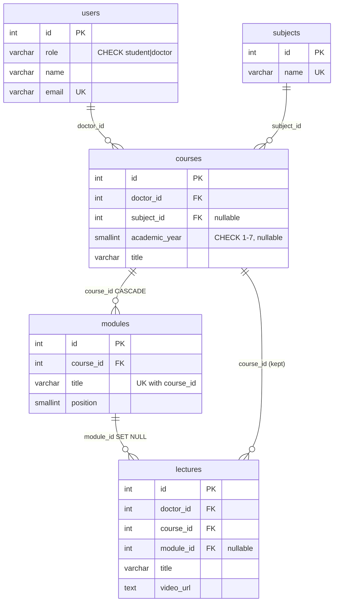
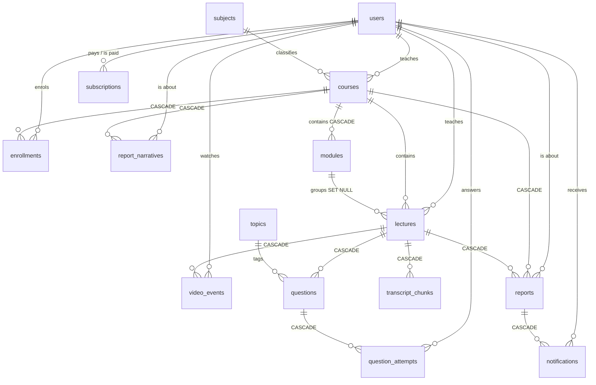

# Entity relationship diagram

Generated from the live schema. Keep it in step with `db/schema.sql`.

Legend: `PK` primary key · `FK` foreign key · `UK` unique · **CASCADE** / **SET NULL**
are the `ON DELETE` behaviours.

## The catalog spine

What a conversational catalog search walks. `lectures.course_id` is kept
alongside `module_id` on purpose — enrolment, subscriptions, reports and the
engagement replay all hang off course→lecture and must not depend on a module
that may not exist.

## Full schema

`query_embeddings` has no foreign key: it is a standalone cache keyed by
`(query_hash, model, dim)`.

## Every foreign key

| Child | Column | Parent | ON DELETE |
| --- | --- | --- | --- |
| courses | doctor_id | users | — |
| courses | subject_id | subjects | — |
| modules | course_id | courses | CASCADE |
| lectures | doctor_id | users | — |
| lectures | course_id | courses | — |
| lectures | module_id | modules | SET NULL |
| enrollments | student_id | users | — |
| enrollments | course_id | courses | CASCADE |
| subscriptions | student_id | users | — |
| subscriptions | doctor_id | users | — |
| transcript_chunks | lecture_id | lectures | CASCADE |
| video_events | student_id | users | — |
| video_events | lecture_id | lectures | CASCADE |
| questions | lecture_id | lectures | CASCADE |
| questions | topic_id | topics | — |
| question_attempts | student_id | users | — |
| question_attempts | question_id | questions | CASCADE |
| reports | student_id | users | — |
| reports | course_id | courses | CASCADE |
| reports | lecture_id | lectures | CASCADE |
| report_narratives | student_id | users | — |
| report_narratives | course_id | courses | CASCADE |
| notifications | user_id | users | — |
| notifications | student_id | users | — |
| notifications | report_id | reports | CASCADE |
